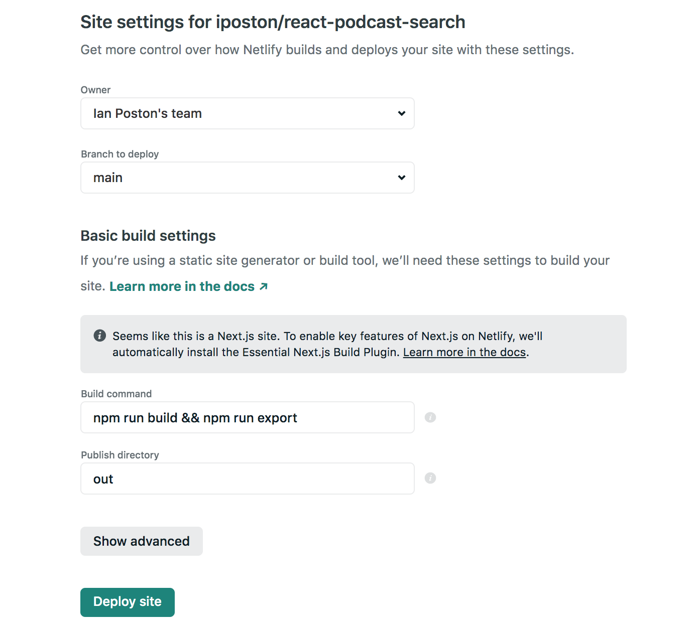

# Podcast search app SSR Next.js React and Alan AI

This is a single page server side rendered app which uses the [Alan AI](https://alan.app) to get enable voice commands to search [podcastsindex.org](https://podcastindex.org) for relative podcasts.

### Description
This AI ssr [app](https://react-podcast-search.netlify.app/) was created with react framework [Next.js](https://nextjs.org/) bootstrapped with [`create-next-app`](https://github.com/vercel/next.js/tree/canary/packages/create-next-app). This AI app is hosted for free on Netlify (cloud application platform). The podcast data is sourced through the [podcastsindex.org](https://podcastindex.org).
 
### You can learn this
* Create a new next server side rendered project with create-next-app.
* Create an Alan Studio account at alan.app. 
* Create a new project and get alan ai api key.
* Initialize the alan button to except voice commands. 
* Create account at podcastindex.org generate api key and secret.
* In alan ai account create a command that sends a request to search podcastindex.org.
* List podcast data in ui.
* Deploy to Netlify.

### Software used for this application
* [Visual Studio Code](https://code.visualstudio.com/) (version 1.38.1)
* Git 2.15.2
* Node.js (version 14.4.0)
* NPM (version 7.10.0)    
* Alan AI [Set up a free account](https://alan.app)
* PodcastIndex API [Set up a free account](https://podcastindex.org)
* @alan-ai/alan-sdk-web 1.8.25 
* classnames 2.2.6
* next 10.1.3
* react 17.0.1
* react-dom 17.0.1 
* words-to-numbers 1.5.1

### Initialize an app with create-next-app
Open your terminal `cd desktop` and type the command `npx create-next-app`. Then you will be prompted to name your project. The project folder will be on your desktop, open the project with Visual Studio Code (free code editor). 

### Sign up for an account at Alan Studio
I am using The Alan Studio API to implement voice commands in this app. I signed up at [https://studio.alan.app/register](https://studio.alan.app/register) and clicked sign up with GitHub. You can also create an account with your email. You will get 50 free interactions (api requests) after the account is created.

### Create a new project and get alan ai api key.
Sign into your Alan Studio account and navigate to the projects home page. To find the projects page click on the Alan Studio logo on the left side of navigation bar at the top of the page or navigate to https://studio.alan.app/projects. Create new project by clicking on the Create Voice Assistant button located on the right side of the nav bar. Click on the Empty project selection and then you will be prompted to name the project. Once you create the empty project you get redirected into the project dashboard where you can find the project's api key. On the right side the of the nav bar click the the </> Integrations button and you'll find the Alan SDK Key (api key) at the top heading of the page. Now you will copy the key and paste it into the your next.js app. Go to `project-name/pages/index.js` and paste the key at the top of the file `const alanKey = 'your-key-here';`.

### Set up voice commands.
This app requires some third party packages for the AI voice commands to work properly. In the terminal `cd` into the project then type `npm i @alan/ai classnames and words-to-numbers`. The `@alan-ai/alan-sdk-web` package is going allow me to add a microphone button icon to the app. We need to use the alan `apiKey` to initialize the button. We need import useEffect from react to make a request to the alan api. 

 Type `npm run dev` to serve the app, go to [http://localhost:3000](http://localhost:3000), and the microphone icon will appear at the bottom right of the page. The `create-next-app` team is kind enough to provide a nice home page with styles I just had to make a few adjustments to make my homepage for this app.

 We can test our voice command by going to the Alan studio dashboard project page and add this line `intent('What is this?', reply('This is a react AI project.'));`. Click the microphone icon button and say "What is this?" and you will hear a voice say "This is a react AI project.".

```js

import Head from 'next/head'
import styles from '../styles/Home.module.css'
import { useEffect } from 'react'
const alanKey = 'your-key-here'

export default function Home() {
 
  useEffect(() => {
    const alanBtn = require('@alan-ai/alan-sdk-web');
    alanBtn({
      key: alanKey,
      onCommand: () => {}
    })
  }, [])
  
  return (
    <div className={styles.container}>
      <Head>
        <title>Title</title>
        <link rel="icon" href="/favicon.ico" />
      </Head>

      <main className={styles.main}>
        <h1 className={styles.title}>
          Title
        </h1>

        <p className={styles.description}>
          description
        </p>

        <div className={styles.grid}>
          content...

        </div>
      </main>

      <footer className={styles.footer}>
        Created by Ian Poston 2021
      </footer>
    </div>
  )
}

```

 ### Create account at podcastindex.org
 I created an account at [podcastindex.org](podcastindex.org) to enable the ability to make a search request for podcasts. To authenticate the search request I needed to generate an `api key` and `secret`. When you set up your free account at podcastindex.org you can generate your api key by going to [https://api.podcastindex.org/signup](https://api.podcastindex.org/signup). When you sign up for a free account the api key and secret are emailed to the email address used to sign up.

 In this example I am searching for podcasts by a search term. For example if I say "give me podcasts by NPR" the api request to get results is `'https://api.podcastindex.org/api/1.0/search/byterm?q=NPR'`. For more api requests info for podcastindex go to [https://podcastindex-org.github.io/docs-api/#get-/search/byterm](https://podcastindex-org.github.io/docs-api/#get-/search/byterm).

### Create a command that sends an API request.
 I added the api request, the api key, and secret to the my alan studio project.

 ```js

 //alan studio project

intent('What is this?', reply('This is a react AI project.'));

const API_KEY = 'PodcastIndex apiKey';
const SECRET = 'PodcastIndex secret';

//Podcasts by source
intent('Give me podcasts from $(source* (.+))', (p) => {
    let PODCAST_API_URL = 'https://api.podcastindex.org/api/1.0/search/byterm?q='
    
    if(p.source.value) {
       PODCAST_API_URL = `${PODCAST_API_URL}${p.source.value.toLowerCase().split(" ").join('-')}`
       p.play({url: PODCAST_API_URL, key: API_KEY, secret: SECRET})
    }
});

 ```

 The AI will detect the `source` which is the word said after "from" in your voice request. Then concatenate the `source` to the api endpoint. Then using `p.play({url: PODCAST_API_URL, key: API_KEY, secret: SECRET})` I am passing everything I need to authenticate my request in the app. 
 
 ### List podcast data in ui.
 Using `node-fetch` I build a request in my app. When the payload from the api is sent back in a `response` I will use `useState` from react to set the items in an array to be repeated and rendered in the ui.

 Outside of the `useEffect` scope I define `useState` with this line `const [items, setItems] = useState([])`. Inside the the `fetch` api request I use `setItems` to initialize the `data` from the api response `setItems(data['feeds'])`. Once the `data` is set in `useState` we can loop through the results and show the items in the ui. In the ui I want to show the title, access the link, and show the podcast image. If the `item.image` is missing/empty I use a ternary condition to use a static image located in the `/public` folder instead. For this example I am not using the separate component architecture and to keep it simple I am doing everything in `index.js`.

 ```js

 //index.js
import Head from 'next/head'
import styles from '../styles/Home.module.css'
import { useState, useEffect } from 'react'
const fetch = require('node-fetch')
const crypto = require('crypto')
const alanKey = ALAN_API_KEY;

export default function Home() {
  const [items, setItems] = useState([])
 
  useEffect(() => {
    const alanBtn = require('@alan-ai/alan-sdk-web');
    alanBtn({
      key: alanKey,
      onCommand: ({ url, key, secret }) => {
        console.log(url, 'search url request')

        const APIKEY = key
        const APISECRET = secret

        const ts = Math.floor(Date.now() / 1000)
        const authString = APIKEY + APISECRET + ts.toString()
        const authHeader = crypto.createHash('sha1').update(authString).digest('hex')

        fetch(url,
          {
            method: 'GET',
            headers: {
              "User-Agent" : "homemade pod-fetcher 0.026b",
              "X-Auth-Date" : ts,
              "X-Auth-Key"  : APIKEY,
              "Authorization" : authHeader
            },

          }
        ).then(
          res => {
            console.log(res.status, res.statusText)
            console.log(res.headers)
            console.log(res)
            return res.json()
          }
        ).then(
          data => {
            console.log('success got data:')
            console.log(data['feeds'])
            setItems(data['feeds'])
          },
          err => {
            console.log('got error:')
            console.log(err)
          },
        )
        

      }
    })
  }, [])
  return (
    <div className={styles.container}>
      <Head>
        <title>Podcast Search SSR App</title>
        <link rel="icon" href="/favicon.ico" />
      </Head>

      <main className={styles.main}>
        <h1 className={styles.title}>
          Podcast Search
        </h1>

        <p className={styles.description}>
          Use the microphone to make a search. Example: "Give me podcasts from NPR"
        </p>

        <div className={styles.grid}>
          {!items.length && 'No search results: try again'}
          {items.map((item) => (
            <a href={item.link} key={item.id} className={styles.card} title={item.title} style={{
              width: 128,
              height: 360,
              backgroundImage: `url(${(item.image) || "/podcast-icon.png"})`
            }}> 
            </a>
          ))}
        </div>
      </main>

      <footer className={styles.footer}>
        Created by Ian Poston 2021
      </footer>
    </div>
  )
}

 ```

 When I created this `next.js` app it came with some nice css styles that I re-used for this project, I simply made a few tweaks to make look good for this project.

 ```css

/*Home.module.css */

.container {
  min-height: 100vh;
  padding: 0 0.5rem;
  display: flex;
  flex-direction: column;
  justify-content: center;
  align-items: center;
}

.main {
  padding: 5rem 0;
  flex: 1;
  display: flex;
  flex-direction: column;
  justify-content: center;
  align-items: center;
}

.footer {
  width: 100%;
  height: 100px;
  border-top: 1px solid #eaeaea;
  display: flex;
  justify-content: center;
  align-items: center;
}

.title {
  margin: 0;
  line-height: 1.15;
  font-size: 4rem;
}

.title,
.description {
  text-align: center;
}

.description {
  line-height: 1.5;
  font-size: 1.5rem;
}

.grid {
  display: flex;
  align-items: center;
  justify-content: center;
  flex-wrap: wrap;
  max-width: 800px;
  margin-top: 3rem;
}

.card {
  margin: 1rem;
  flex-basis: 45%;
  padding: 1.5rem;
  text-align: left;
  color: inherit;
  text-decoration: none;
  border-radius: 10px;
  transition: color 0.15s ease, border-color 0.15s ease;
  background-repeat: no-repeat;
  background-position: center;
  background-size: 360px;
  box-shadow: 0 1px 3px rgba(0,0,0,0.12), 0 1px 2px rgba(0,0,0,0.24);
  transition: all 0.3s cubic-bezier(.25,.8,.25,1);
}

.card:hover,
.card:focus,
.card:active {
  box-shadow: 0 14px 28px rgba(0,0,0,0.25), 0 10px 10px rgba(0,0,0,0.22);
}

.card h3 {
  margin: 0 0 1rem 0;
  font-size: 1.5rem;
}

.card p {
  margin: 0;
  font-size: 1.25rem;
  line-height: 1.5;
}

@media (max-width: 600px) {
  .grid {
    width: 100%;
  }

  .card {
    flex-basis: 66%;
  }
}

 ```

 ### Deploy to Netlify.
 To follow along with this part of the tutorial it requires a github account. The app needs to be pushed to a new repository but before committing the app make sure to remove the `alan api key` from index.js. That key will be added securely to Netlify config settings after we deploy the app. Don't expose private keys to github.

 I decided to deploy this app to Netlify because it's free and I've been wanting to use this service for a while now since I heard so much good things about them.

 Go to [https://www.netlify.com/](https://www.netlify.com/) and click sign up. From the sign up page use your github account to sign up. We will deploy this app straight from the github repo so you will need to authorize netlify to have read access of the repository that you pushed your code to.

 Before we deploy this app we need to add this build command `"export": "next export"` to the `package.json` file on line 9 inside the `scripts:` attribute. And add a `netlify.toml` file to the root of the app with these two lines added to it `command = "npm run build && npm run export"` `publish = "out"`. 

 I had to add the alan ai `apiKey` to my netlify account since I did not push the key to my public repo. First on line 6 of `index.js` add this line `const alanKey = process.env.NEXT_PUBLIC_KEY;`. 

 To get started with the Netlify deploy sign in and go to [https://app.netlify.com/start](https://app.netlify.com/start). There is a 3 step process to deploy, 1. Connect to git provider, in this example I clicked GitHub, 2. Pick Repository, click the name of the repo that has the code, and finally 3. Site settings and deploy. There are 4 settings to consider before deploy. The owner name will be auto filled with your team name that you use when you set up the Netlify account and the second setting is the branch name that we are deploying from which will be `main`. Through some trial and error and with some helpful comments from Netlify users I had to add this build command to the settings `npm run build && npm run export` and the last setting type `out` for the Publish directory. Then click Deploy site button. 

 

  After deploying to Netlify from the top of page navigation menu click Site Overview then just below click the Site settings button. On the left side there is a vertical menu click Build & deploy option then click Environment option from the same menu and click edit variables button and add key: `NEXT_PUBLIC_KEY` value: `apiKey` and click Save. Go to the site url and you're all good to test your app.

  ### References
  1. [https://javascript.plainenglish.io/getting-started-with-react-server-side-rendering-using-next-js-ba9ed691fa85](https://javascript.plainenglish.io/getting-started-with-react-server-side-rendering-using-next-js-ba9ed691fa85)
  2. [Build and Deploy a Voice Assistant App | Alan AI, React JS](https://www.youtube.com/watch?v=rqw3OftE5sA) 


